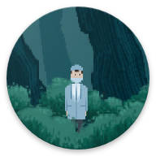
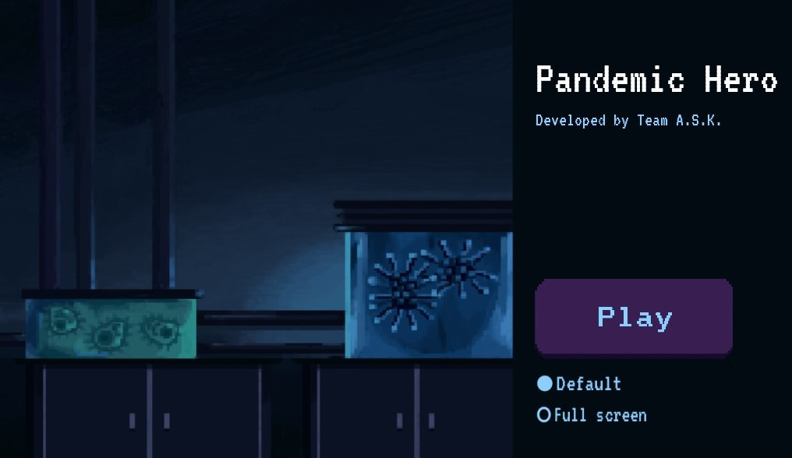
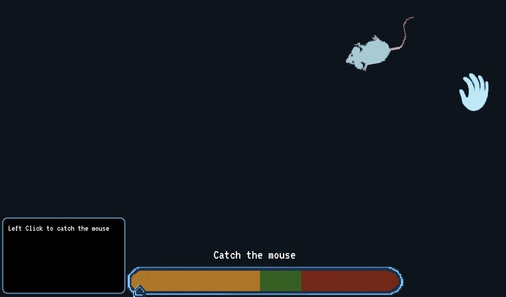
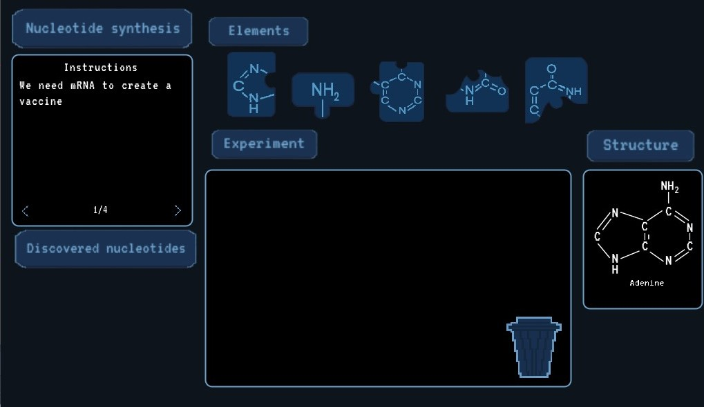

# <div align="center">Pandemic Hero</div>


<div align="center">Your journey to save the world</div>

<div align="center"></div>

<div align="center"><h4>Please do not use any image assets used in this game without contacting the artist (Simi) first. Artists repo and contact can be found below.</h4></div>

# Table of Content:
- [Display Shots](#display-shots)
- [Programming Language used ](#programming-language-used)
- [Opening the project](#opening-the-project)
- [Playing on website](#playing-on-website)
- [Key Features](#key-features)
- [Contact info](#contact-info)
- [Member List and github repo](#member-list-and-github-repos)
## Display shots

<div align="center"></div>  
<div align="center"></div>  
<div align="center"></div>  

# Programming language used

This project uses Godot and gdScript to bring our game to life. On the backend we are using python to build our model and serve its output to the players.

## Prerequisites
1) Go to godotengine.org e click Download at the top of the site
2) Download the Standard Version for your system
3) Extract and copy the executable to a folder of your choice. Godot is self-contained and does not require installation.


## Opening the project 
1) Open godot engine.
2) Scan the folder which has the scrips, scenes and assets
3) Double click to open it in editor
4) Open FirstCutScene scene
5) Click play on top right and enjoy!


## Playing on the website


# Key Features
- Learn about covid and covid vaccines.
- Clear instructions on every level to enhance learning.
- Beautiful UI that pleases the player and dark theme which is easy on the eyes.
- Small story to motivate players to keep playing till the end.
- Reccomendation system that will recommend players articles on covid 19 to motivate learning even outside the game.

# Future Scope 
- Better our recommendation system and have better score on predicting the user.
- Add more puzzles to enhance learning
- Make our product suitable for integration into schools 
- Have more depth to the storyline.


 
 # Contact info 
 
 ```
 simiwei2017@gmail.com
 ```
 ```
 kennyjiahuacheng@gmail.co
 ```
 ```
 avichare@sfu.ca
 ```

 
 # Member list and Github repos
 - Ash :  https://github.com/AshCatchEmAll
 - Kenny : https://github.com/kennyjhcheng
 - Simi : https://github.com/simidesigns

 

