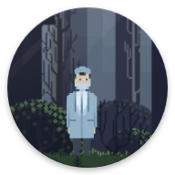

 You-Cured-COVID-19

NWHacks submission

🚧 Undercooked Product 🚧

*Drag logic inside worktableitem.gd

*preview the alchemy.tscn scene to try game

*clicking one of the icons in the left panel will create an instance of worktableitem in the worktable.

*dragging doesn't work in worktable.
